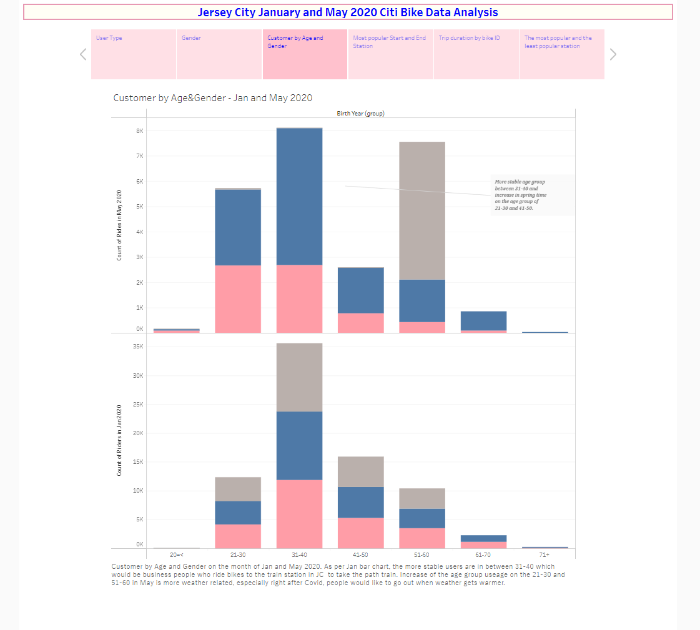

# Tableau - Citi Bike Analytics

I have used two months data from [Citi Bike Data](https://www.citibikenyc.com/system-data). 

* JC-202005-citibike-tripdata.csv
* JC-202001-citibike-tripdata.cvs

Here is my Tableau link: https://public.tableau.com/app/profile/kate.yayla/viz/TableauChallenge-JerseyCityJanandMay2020CitiBikeAnalysis/Story1?publish=yes

### User Type

I have discovered from my data, the number of users in Jan 2020 and May 2020 are same. I was expecting more biker in May 2020. I assume when Covid-19 started in March, it decreased the usage of bike and when it gets warmer in May, number of users increased again. But still total number of bikers are very similar for two months data. 

On the other hand, we can see more subscriber in Jan, more random customer type in May on the user type visualization. I believe, CitiBike user cancelled their subscription because of policy of working from home in most companies. And we can see more random biker in May 2020. 

### Usage by Gender

When unspecified biker gets bigger, it lowers the male for the comparison between Jan and May data. Maybe less data available for customer, if they are not subscriber. If user just randomly rent the bike (which called customer), there would be no data available for gender classification. After Covid-19,number of subscribers cancelled their membership and used randomly, this might cause more unspecified user. 

### User by Age and Gender

As per May and Jan 2020 data, we can see that there is more stable user age group between 31-40 and increased in spring time on the age group of 21-30 and 41-50.

As per this data, I can say that most users are working professional and taking PATH train to the city. Other age group usage increase might be depending on Covid or/and weather related.

### Most Popular Start and End Station

The five most poupular *start* and *end* station in Jan are the same as Liberty, Newport, JC Medical, Grove Path and Marin Light Rail. 

The five most poupular *start* and *end* station in May are also the same as Grove Path, Sip Ave, Hamilton Park, Columbus Ave and Harborside. 

As mentioned above, the most popular station are the ones that close to the PATH train station. This analysis also support my previous analysis above which most users are working professional and taking PATH train to the city. The Jackson Square and Union St station are the least popular stations which are far away from the train stations. 

* The most and least popular stations are in the map

### Trip Duration by Bike ID 

It seems that CitiBike included more bikes in their fleet in May 2020 which are not seen in Jan 2020 data. So, newer bikes are more used ones as per trip duration on May 2020 data. The most used one in May is bike id#424477 with 946,311 second as trip duration. Bike ID 26K and 29K are most used bikes in Jan which were removed from May 2020 inventory. In visulation, we are not able to see any 26K and 29K bikes in May 2020. CitiBike added new bikes in May, bike IDs are 43K.   

